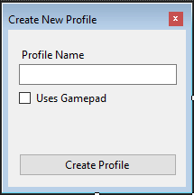
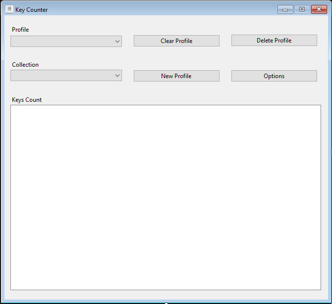

# Key Counter 

An app that monitors and counts key presses and movement for mouse, keyboard and gamepad

## Installation

Open the project in VIsual Studio and build the solution yourself  
**or**  
Download the prebuilt solution found in the folder "build"

## Usage

On the first run of the app you will be prompted to create a new profile  

at least 1 profile must exist so you won't be allowed to proceed until one is created.  

When at least one profile exists the main window of the app is shown

Here you can change, clear or delete the current profile, create new profiles or modify settings.  

Under 'Key Count' the current cont for the selected profile and collection wil be shown with realtime update, where collection is reffering to mouse/keyboard/gamepad/all at once

## How is the monitoring preformed

[Mouse](https://docs.microsoft.com/en-us/windows/win32/winmsg/about-hooks#wh_mouse_ll) and [keyboard](https://docs.microsoft.com/en-us/windows/win32/winmsg/about-hooks#wh_keyboard_ll) monitoring is performed using low level hooks, every time a key is pressed or a movement is detected 
an event is raised with information about the event.  
  
As for the gamepad it is monitored using SharpDX to periodically check the state of the connected gamepad.  
  
After all the necessary info about the input is extracted the information is added to the corresponding collection for the currently selected profile
if the input device that performed the action is also selected in the GUI collection tab the app also updates it's count else the change only happens in memory
where it will be saved in a file on exit or when the profile is switched for another one. 

### App Notes

* The last profile cannot be deleted
* Only one profile can track at a time
* Every collection available in the current profile will continue tracking even if the collection is not currently selected
* The main form will start hidden if the corresponding option has been set
* Minimizing the form will hide it from view and from the taskbar
* If the app is started an icon will appear in the system tray
* Double clicking the system tray icon will show the main form
* Profiles can be changed from the system tray